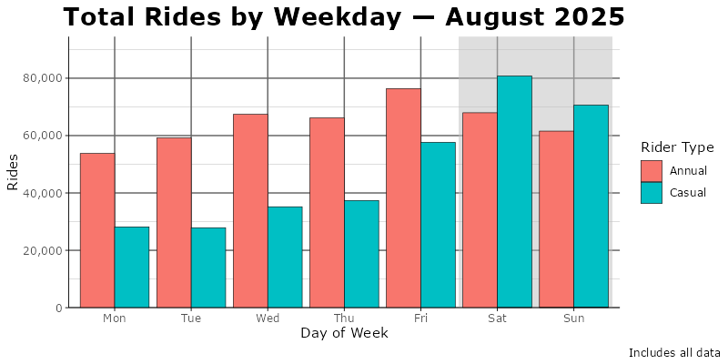
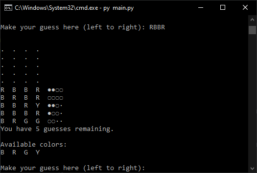
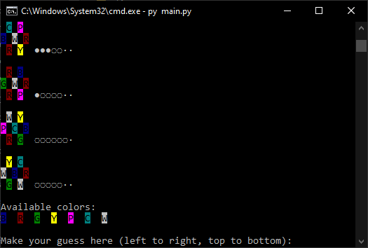
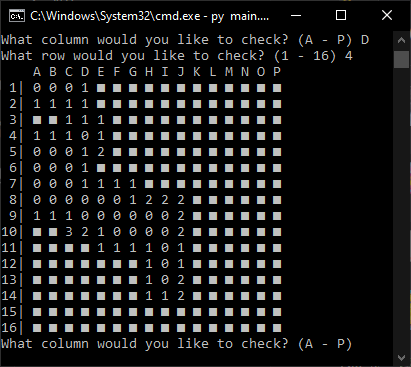
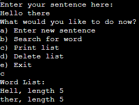
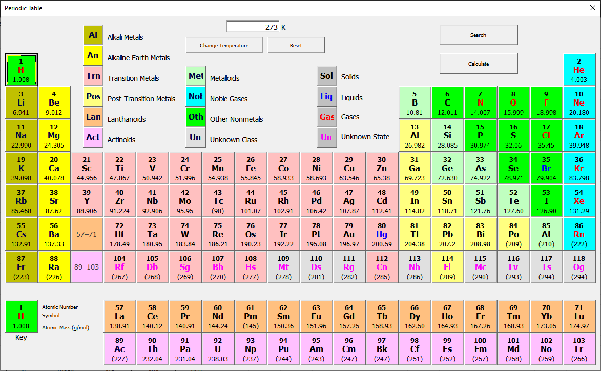
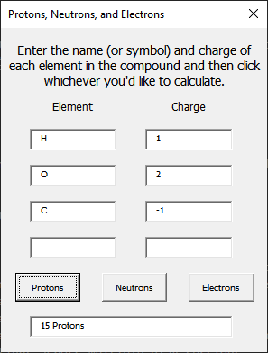

# Featured projects
## [Cyclistic Capstone Project](https://github.com/pgnj99/Google_Cyclistic_Capstone_Analysis)

**Tech Stack:** SQL (SQLite), R (tidyverse, ggplot2, R Markdown), Google Sheets

This project analyzes over 5 million bike-share trip records spanning 12 months to identify behavioral differences between casual riders and annual members, with the goal of informing strategies to convert casual riders into long-term subscribers. Using SQL for data preparation and R for analysis and visualization, the resulting analysis explores ride frequency, duration, trip patterns, time-of-day usage, and station-level activity to uncover actionable insights for business decision-making. This project strengthened my skills in data cleaning, handling large datasets, and communicating technical insights to non-technical stakeholders.

This is a capstone project for the Google Data Analytics Professional Certificate course offered by Coursera. The course can be found here: [Coursera](https://www.coursera.org/professional-certificates/google-data-analytics)

Report: [RPubs](https://rpubs.com/pgnj99/1391856)
Slideshow: [Google Slides](https://docs.google.com/presentation/d/e/2PACX-1vQlZ7wXa_9jKSQkzUjVS7eNJ-WWJbjizTnlwpKftyE73Ccg5oFt1xv7G78qoL1l9iTqZvVMdiDzarJY/pub?start=false&loop=false&delayms=30000)

**Key points:**
- Casual riders ride more during weekends on warm months, compared to annual members having more consistent activity on weekdays.
- Casual riders seem to prefer leisure-oriented trips, whereas annual members prefer practicality.
- Both annual and casual riders primarily use electric bikes as their vehicle of choice.
- Business recommendations include running seasonal promotions, adjusting marketing to casual rider motivations, introducing low-committal passes, tying e-bike perks to annual memberships, and targeting stations with high casual rider usage.

# Additonal projects
## [Python Master Mind](https://github.com/pgnj99/python-mastermind)

**Tech Stack:** Python, object-oriented programming (OOP), file I/O

This project is a Python adaptation of the paper & pencil game codebreaker, also known by the board game adaptation Master Mind. Enter a sequence of characters to guess the secret "code" based on the available marks. Multiple game modes and levels of customization are available, and player settings are saved through a separate file. Utilizes modules, input validation, inheritance, polymorphism, file access, and ANSI color codes.

**Features:**
- A classic-styled game mode in which player can make limited amount of guesses recorded on game board.
- A puzzle-styled game mode inspired by online adaptations in which player must use pre-set clues to determine code.
- Customizable peg numbers for classic game and difficulty options for puzzle game.
- Detailed in-game instructions for each game mode.
- Options menu to enable colored pegs, change mark symbols, or toggle repeatable colors on board.
- File creation and management to retain settings across multiple play sessions.

## [Python Minesweeper](https://github.com/pgnj99/python-minesweeper)

**Tech Stack:** Python

This project is a simple Python adaptation of Minesweeper. Enter a letter for the column and a number for the row of the cell you want to open. Features multiple difficulty levels, custom board creation, input validation, and empty tile functionality.

## [C Linked List Dictionary Challenge](https://github.com/pgnj99/C-Linked-List-Dictionary-Challenge)

**Tech Stack:** C, linked lists

This project is based on a challenge to write a program in C that takes in a sentence and creates a dictionary of words out of it using a linked list. Several rules were put in place for the implementation, such as to only use global memory and avoid using `strtok` for parsing. This challenge demonstrates user input, static data structure, creation and usage, and output to console.

## [Microsoft Excel Periodic Table](https://github.com/pgnj99/ExcelPeriodicTable)

**Tech Stack:** Microsoft Excel, Visual Basic for Applications (VBA) for Office, macros

This project is an interactive periodic table with chemistry-themed calculators built using Microsoft Excel with VBA and macros. This was created as a final project for my Introduction to Engineering Computation course in May 2018, and I consider this to be the first real programming project I've written. Note that its implementation was left incomplete, and several bugs or crashes may be present.

Follow this guide to run properly in modern versions of Microsoft Excel: https://support.microsoft.com/en-us/topic/a-potentially-dangerous-macro-has-been-blocked-0952faa0-37e7-4316-b61d-5b5ed6024216

**Features:**
- Periodic table with search functionality and states of matter
- Elemental details for hydrogen, helium, and oxygen
- Calculators for proton/neutron/electron counts, molarity, ionic compounds, and percent compositions